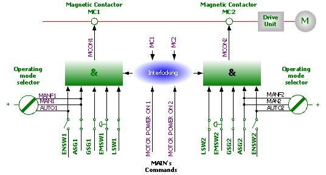

# 1.10.1. Operation of the Safety Electric Circuit

Figure 1.5 Safety Chain Configuration Diagram

The safety system of the robot is configured with a dual safety electric circuit that continuously monitors its status. If an error is detected, the motor power will be cut off immediately and the motor brake will be operated. All switches of the dual safety electric circuit should be connected to recover to the motor On state. If any one of the switches of the dual safety electric circuit is shorted, the contactor of the motor will be disconnected and the brake will be activated to stop the robot. In addition, when the dual safety electric circuit is cut off, an interrupt call will be sent to the controller to identify the cause of the interrupt. 

During the operation, the safety control circuit will be based on the dual safety electric circuit in which the controller and motor ON mode interact with each other. In order for the robot to recover to the motor On mode, the multiple switches comprising the safety electric circuit should be connected entirely. Motor On mode means that the drive current is supplied to the motor. If any contact point in the dual safety electric circuit is broken, the robot always returns to motor Off mode. Motor Off mode means that the driving current is not supplied to the motor of the robot and the motor brake is activated. The status of the switches is displayed on the teach pendant (refer to the “I/O Monitoring” screen in the Operation Manual.) 

<b>Safety Electric Circuit</b>

The emergency stop buttons on the controller control panel and teach pendant respectively and the emergency stop buttons installed on the external facilities are included in the dual safety electric circuit. The safety systems (safety plugs, safety area entry stopping systems, etc.) that operate in auto operation mode can be installed by the user. The signals from the safety systems will be ignored in manual operation. The function of stopping by the safety systems (general safety stop systems) can be used in all operation modes when the user connects them. In other words, in the auto operation mode, all safety systems (doors, safety mats, safety plugs, etc.) will be operated so that no one can enter the safety area of the robot. Signals from the safety systems will be generated even in manual operation mode, but the controller will ignore those signals for the sake of teaching the robot and allowing the robot to operate continuously. In this case, the maximum speed of the robot will be limited to 250 mm/s. In other words, this safety stop function is designed to secure a safe area around the manipulator while a worker approaches the robot to preserve and teach it. 

When the robot is stopped by the limit switch, you can change the position of the robot by jogging the robot with the operation keys of the teach pendant in parameter setting mode (Constant setting mode means the state of entering the 『[F2]: System』 menu in manual mode.) 

<blockquote>
<table border="0">
    <thead>
        <tr>
            <td>
            

              
            

            </td>
            <td colspan="4"> 
                Never ignore, modify or change the safety electric circuit in any way.
            </td>
        </tr>
    </thead>
</table>  
</blockquote> 