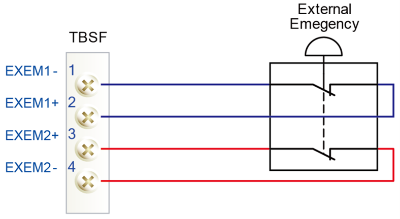

# 1.10.2. Emergency stop

An emergency stop should be operated when a person or equipment is in a dangerous area. All safety control systems such as the emergency stop switch on the controller operation panel, should be easily accessible from outside the safety area.

 **State of Emergency Stop**  

The robot will operate as follows when the emergency stop button is pressed.
The robot will stop immediately in any case.

<ol style="list-style-type:square" start="1">
		<li>
            The power of the robot servo system will be cut off.
        </li>		
		<li>
            The robot motor brake will operate.
        </li>	  
        <li>
        	The screen of the teach pendant will display the emergency stop message.
        </li>
</ol>

The emergency stop can be performed in the following two ways.

<ol style="list-style-type:decimal" start="1">
		<li>
Emergency stop by the operation panel and by the teach pendant (default)  
The emergency stop buttons are on the controller operation panel and teach pendant respectively.
        </li> 
<li>
            Emergency stop by an external system  
            An external emergency stop system (switch, etc.) can be connected to the safety electric circuit based on the standard for application of the emergency stop circuits. (refer to System Board in “Basic Configuration of the Controller”). At this time, the wiring should be laid out in a way that the emergency stop can be in the “Normal On” state, and you must check its operation during the test operation.  
</li> 
</ol>

Figure 1.6 Connection of an external emergency stop switch through TBEM, the system board terminal block.