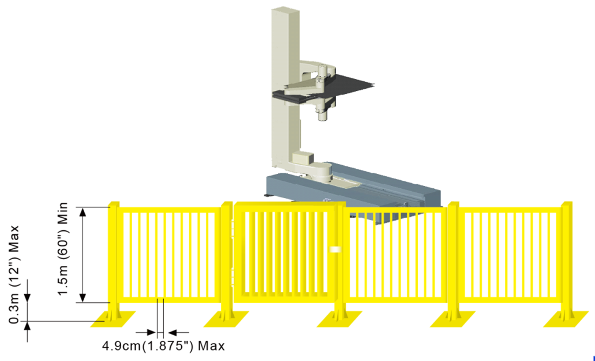
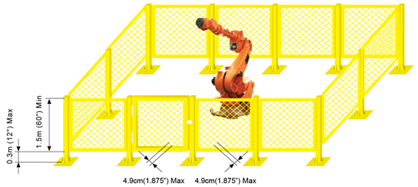

# 1.6.1. Safety Fence

<blockquote>
<table border="0">
    <thead>
        <tr>
            <td>
            

              
            

            </td>
            <td colspan="4">As there is a risk of collision between the robot and the workers while the robot is operating, install a safety fence to keep the workers from approaching the the robot closely.</td>
        </tr>
    </thead>
</table>  
</blockquote> 

As there is a risk of collision between the robot and the workers while the robot is operating, install a safety fence to keep the workers from approaching the robot closely. Otherwise, workers or other people may accidentally enter, causing an accident. Configure the system so that the robot stops when a person opens the door of the safety fence and approaches the facility while the robot is operating to inspect the robot or welding jigs or to perform tip dressing or tip changing.

Figure 1.1 Recommended Sizes for the Safety Fence and Entrance Gate(Slot-Type Entrance Gate)

Figure 1.2 Recommended Sizes for the Safety Fence and Entrance Gate(Quadrangle-Type Entrance Gate)

 

<ol style="list-style-type:decimal" start="1">
		<li>
The safety fence should cover the operation area of the robot, and secure sufficient space so that there is no interference with the workers performing the teaching and maintenance works. In addition, make the safety fence sturdy so that it cannot be easily moved, and make it so that people cannot easily step over it. 
</li> 
    <li>
In principle, the safety fence should be installed in fixed manner. Please use a safety fence that does not have dangerous parts such as irregularities or sharp parts.
</li> 
    <li>
An entrance gate should be installed to allow people to get inside the safety fence. A safety plug should be attached to the entrance gate, making it impossible to open the entrance gate unless the safety plug is pulled out. In addition, the wiring should be laid out in a way that when the safety plug is pulled out or the safety fence is opened, the robot can be put into the Operation Ready Off and Motor Off states.
</li> 
    <li>
The wiring should be laid out in a way that if you want to operate the robot while the safety plug is pulled out, the robot plays back at a low speed.
</li> 
    <li>
Install the robot's emergency stop button at a location where the worker can quickly press it. 
</li> 
    <li>
As a replacement for the safety plug in case of no installation of a safety fence, photoelectric switches, mat switches, etc. should be installed at all locations that fall within the operation range of the robot, so that the robot automatically stops when a person enters.
</li> 
    <li>
It should be made possible to identify the operation area (dangerous area) of the robot by a method such as painting the floor. 
</li> 
</ol>