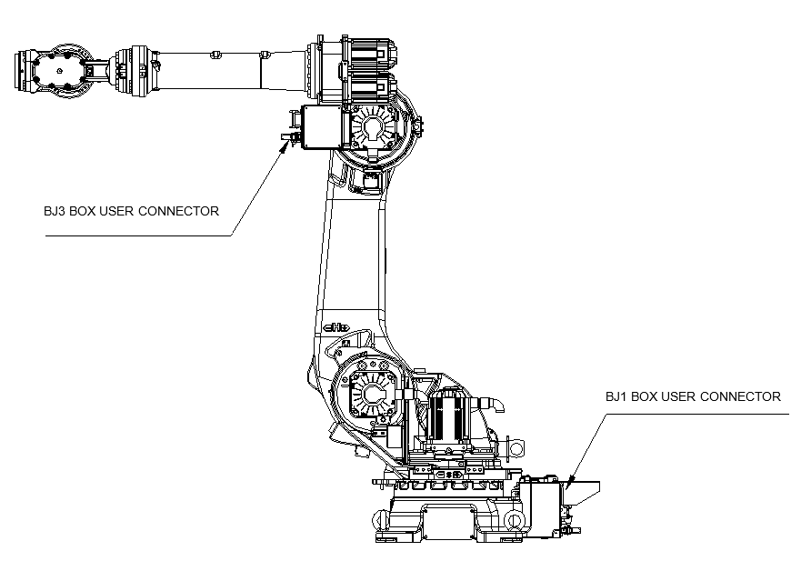
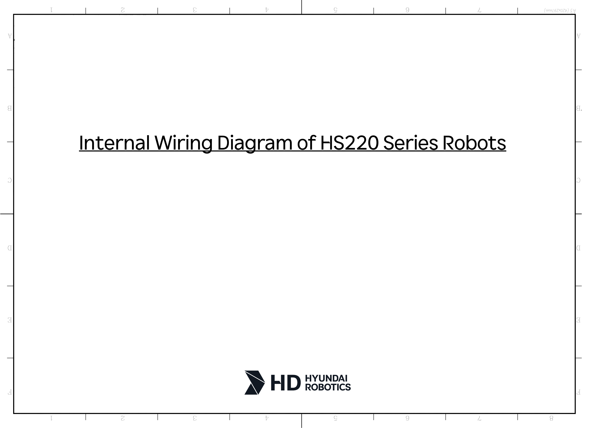

# 10. Diagram for Connection of Wirings inside the Manipulator

Wirings in the manipulator are branched for each unit, and a relevant connection diagram is shown for each. Please use them when checking or exchanging wirings.

Figure 10.1 Placement of Parts inside the Manipulator

