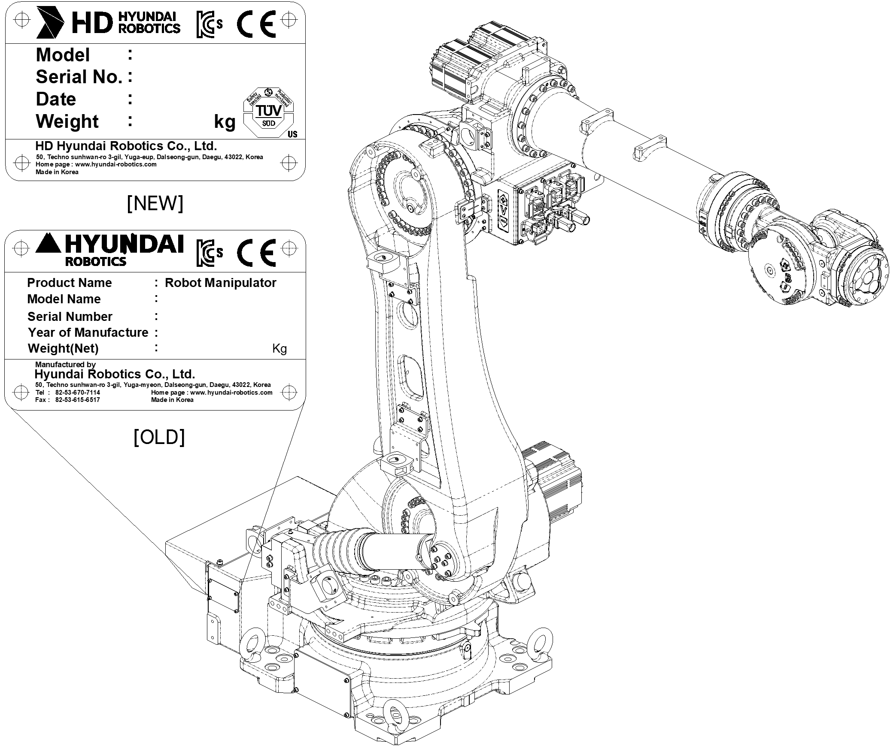

# 2.2. Location of the Robot Nameplate

The nameplates shows the robot type, the serial number, and the manufacture date

The nameplate is located on the bottom surface (left or right) of the manipulator as shown in the figure below.

Figure 2.2 Attachment Location of the Robot Nameplate
