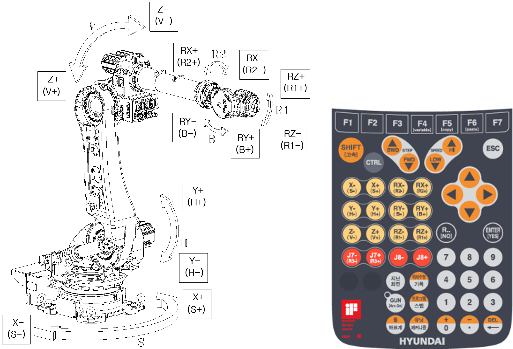

# 2.5. Names of Operation Axes

</table>

<table class="tg">
<caption>Table 2-2 Rotational Direction of Each Axis</caption>  
<thead>
  <tr>
    <th class="tg-bgl2">Axis name</th>
    <th class="tg-bgl2">Operation</th>
    <th class="tg-bgl2" colspan="2">Button on the teach pendant</th>
  </tr>
</thead>
<tbody>
  <tr>
    <td class="tg-jnja">Axis 1 (S)</td>
    <td class="tg-baqh">Swivel</td>
    <td class="tg-baqh">X+(S+)</td>
    <td class="tg-baqh">X-(S-)</td>
  </tr>
  <tr>
    <td class="tg-jnja">Axis 1 (H)</td>
    <td class="tg-baqh">Forward and backward</td>
    <td class="tg-baqh">Y+(H+)</td>
    <td class="tg-baqh">Y-(H-)</td>
  </tr>
  <tr>
    <td class="tg-jnja">Axis 3 (V)</td>
    <td class="tg-baqh">Upward and downward</td>
    <td class="tg-baqh">Z+(V+)</td>
    <td class="tg-baqh">Z-(V-)</td>
  </tr>
  <tr>
    <td class="tg-jnja">Axis 4 (R2)</td>
    <td class="tg-baqh">Rotation 2</td>
    <td class="tg-baqh">RX+(R2+)</td>
    <td class="tg-baqh">RX-(R2-)</td>
  </tr>
  <tr>
    <td class="tg-jnja">Axis 5 (B)</td>
    <td class="tg-baqh">Bend</td>
    <td class="tg-baqh">RY+(B+)</td>
    <td class="tg-baqh">RY-(B-)</td>
  </tr>
  <tr>
    <td class="tg-jnja">Axis 6 (R1)</td>
    <td class="tg-baqh">Rotation 1</td>
    <td class="tg-baqh">RZ+(R1+)</td>
    <td class="tg-baqh">RZ-(R1-)</td>
  </tr>
</tbody>
</table>

  

Figure 2.5 External Appearance of the Manipulator and the Operation Axes