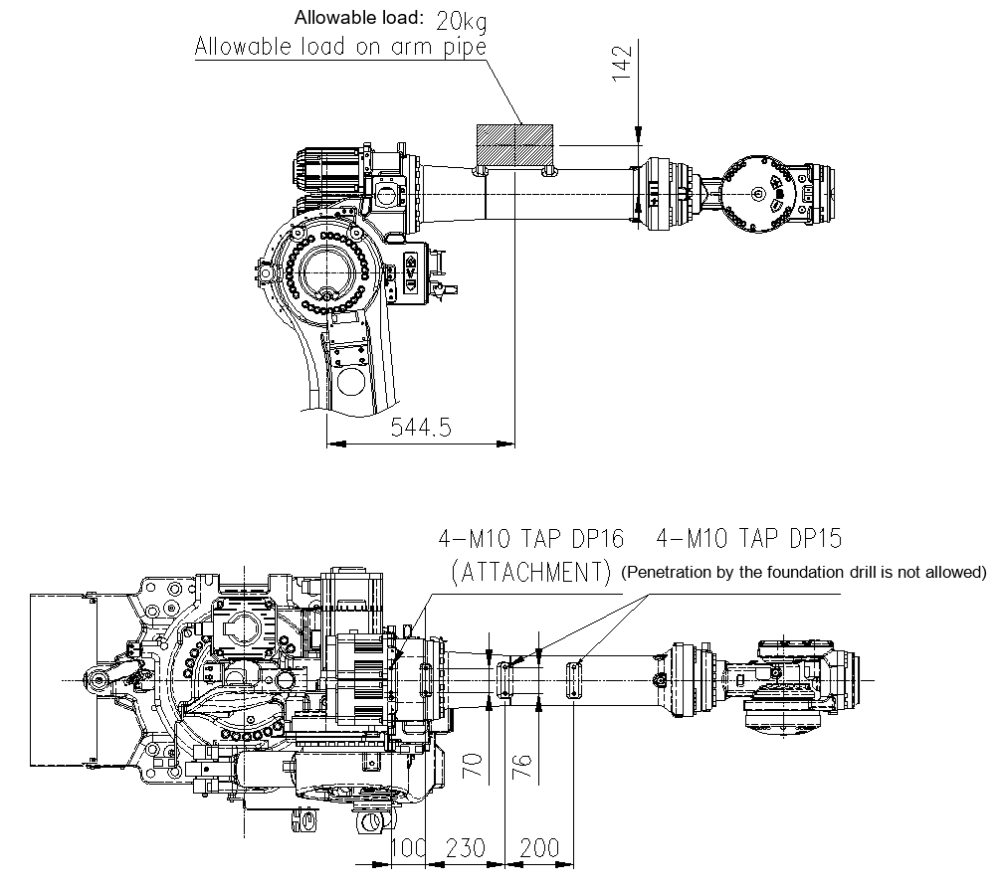

# 2.7. Detailed Diagram of the Attachment Surface on the Top of the Arm Frame

There are taps machined on the tops of the arm frame and arm pipe of the robot to allow a peripheral device to be attached.

Attach a peripheral device (valves, etc.) within the range marked as ▦. 

<b>[Precautions in handling]</b>

Attach a peripheral device to either the upper part of the arm frame or the upper part of the arm pipe. Perform attachment in a way that the central position of the load falls within the range marked as ▦.

*	Maximum load on the arm pipe: 20 kg

Figure 2.7 Detailed Diagram of the Attachment Part on the Top of the Arm Frame (HS180/HS220)

Figure 2.8 Detailed Diagram of the Attachment Part on the Top of the Arm Frame (HS160L)
