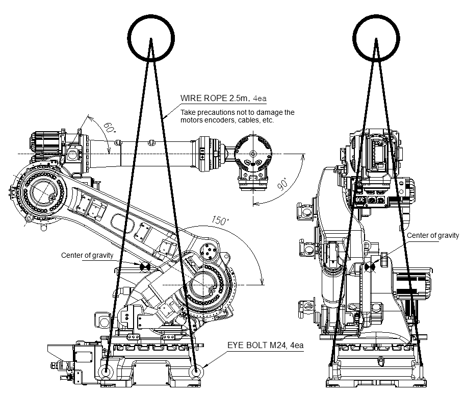

# 3.3.1. Using a Crane

<table class="tg">
<thead>
  <tr>
    <th class="tg-baqh">S-Axis</th>
    <th class="tg-baqh">0</th>
  </tr>
</thead>
<tbody>
  <tr>
    <td class="tg-baqh">H- Axis</td>
    <td class="tg-baqh">150</td>
  </tr>
  <tr>
    <td class="tg-baqh">V- Axis</td>
    <td class="tg-baqh">-60</td>
  </tr>
  <tr>
    <td class="tg-baqh">R2- Axis</td>
    <td class="tg-baqh">0</td>
  </tr>
  <tr>
    <td class="tg-baqh">B- Axis</td>
    <td class="tg-baqh">-90</td>
  </tr>
  <tr>
    <td class="tg-baqh">R1- Axis</td>
    <td class="tg-baqh">0</td>
  </tr>
</tbody>
</table>

  Figure 3.3 How to Transport: Using a Crane

 

The following instructions for lifting the robot are valid for the robots in factory condition. Adding additional equipment to the manipulator will change the center of gravity and make lifting difficult.

*	Never walk under the manipulator,
*	Put the robot into the posture as shown in the figure.
*	Install four M24 eyebolts to the base body.
*	Connect the wire rope (four units) to the eye bolt (four units)
*	Minimum crane capacity: 2.5 tons. Minimum rope capacity: 1 ton/piece
*	Attach a protective hose (50 cm) to prevent the manipulator from being damaged.
*	Follow the safety regulations when lifting the robot.
*	Fix the ropes while being careful not to damage the motors, connectors, and cables of the robot.
*	Manipulator weight: 

<table class="tg">
<thead>
  <tr>
    <th class="tg-baqh">Model</th>
    <th class="tg-baqh">HS160L</th>
    <th class="tg-baqh">HS180</th>
    <th class="tg-baqh">HS220</th>
  </tr>
</thead>
<tbody>
  <tr>
    <td class="tg-baqh">Weight (kg)</td>
    <td class="tg-baqh">985</td>
    <td class="tg-baqh">955</td>
    <td class="tg-baqh">955</td>
  </tr>
</tbody>
</table>