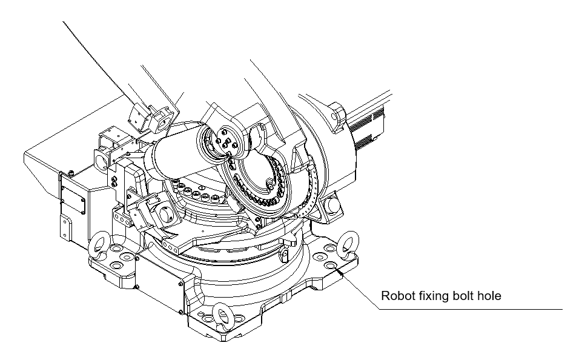

# 3.3. How to Transport

The robot can be transported using a crane and forklift. When moving the robot, put the robot into a posture suitable for each transport situation as shown in the figure below, and transport it using eyebolts and designated transportation equipment.

-	You need to move or unload the robot slowly and very carefully.

-	When unloading the robot onto a floor, be careful not to cause a strong collision between the bottom installation surface of the robot and the floor surface. 
-	Never transport the robot by means other than the specified transport equipment and methods.
-	When transporting the robot, be very careful not to allow the motors, connectors, cables, etc. of the robot to be damaged by the crane wire or forklift.
-	When transporting the robot, make it keep its horizontal level.
-	When transporting the robot using a forklift, check the bolts fixing the transport equipment and tighten any loose bolts.
-	When you disassemble or assemble the transport equipment (forklift brackets), the manipulator will slide. Fix the robot with bolts using the robot fixing bolt holes to prevent the robot from falling over.

