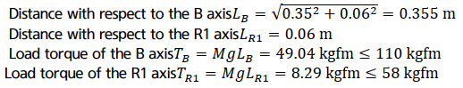
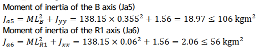
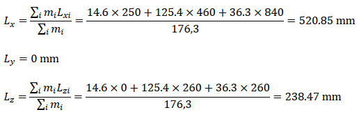
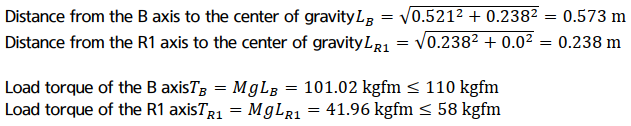
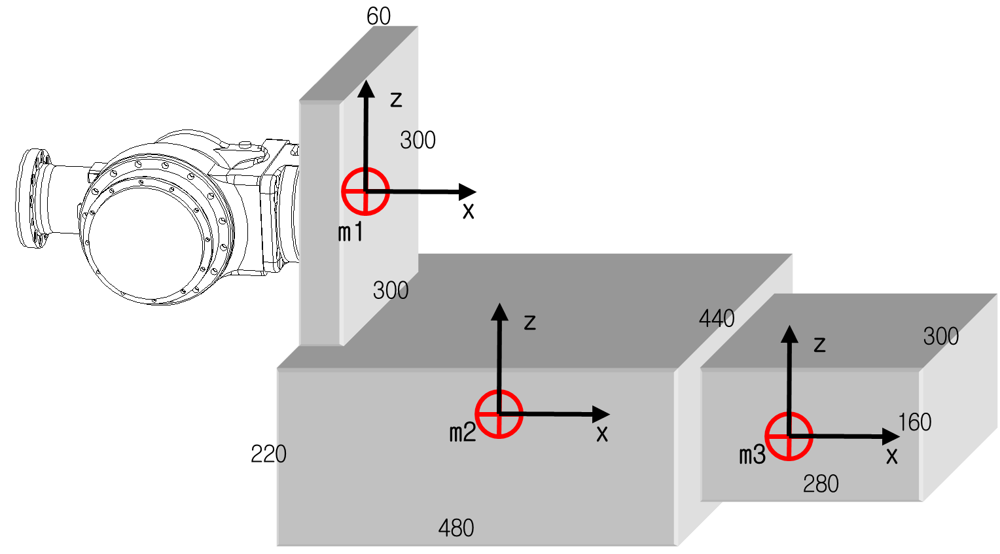
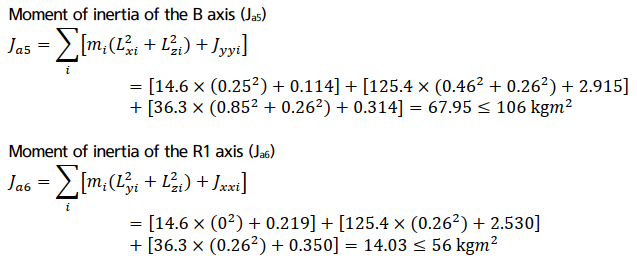

# 3.6.3. Examples of Calculation of the Allowable Torque and Allowable Moment of Inertia (HS180)

(1)	Case #1 Simple two-dimensional model

Figure 3.11 Two-Dimensional Load Model

M - Load weight 

Jxx - Moment of inertia in the direction of the X axis at the center of the gravity of the load

Jyy - Moment of inertia in the direction of the Y axis at the center of the gravity of the load

Jzz - Moment of inertia in the direction of the Z axis at the center of the gravity of the load

Ja4 - Moment of inertia at the center of rotation of the R2 axis

Ja5 - Moment of inertia at the center of rotation of the B axis

Ja6 - Moment of inertia at the center of rotation of the R1 axis

 
  
☞ Load condition: Stainless Steel (with mass of 138.15 kg) with a width of 260 mm and a thickness of 260 mm

① Weight limit

Load weight: 138.15 ≤180 kg

 

② Limit of the allowable torque

The position of the center of gravity with respect to B axis LX = 350mm, LY = 0mm, LZ = -60mm

Each distance from B axis and R1 axis to the center of gravity can be calculated respectively as follows.

 

③ Limit of the allowable moment of inertia

The moments of inertia of the load at the center of gravity  Jxx= 1.56kgm², Jyy= 1.56 kgm², Jzz= 1.56 kgm²
    

 
  
④ Conclusion

It is safe because all conditions of weight, torque, and moment of inertia satisfy the conditions of limit.

  

(2)	Case #2 Complex three-dimensional model

Figure 3.12 Two-Dimensional Shape of a Three-Dimensional Load Model

  

Combination of aluminum block shapes
(σ=0.0027 g/mm3 : 176.3 kg)

m1 (60 X 300 X 300)	 14.6kg

m2 (480 X 440 X 220)	125.4kg

m3 (280 X 300 X 160)	 36.3kg

 

mi  - Load weight of i block

Lxi - - Position of the center of gravity of i block in the direction of X axis

Lyi - - Position of the center of gravity of i block in the direction of Y axis

Lzi - - Position of the center of gravity of i block in the direction of Z axis

 

① Weight limit

Load weight: 176.3 ≤180 kg

② Limit of the allowable torque

The position of the center of gravity of all loads at the center of rotation of the B axis can be calculated as follows.

 

Position of the center of gravity of all blocks with respect to B axis Lx = 520.85mm, Ly = 0mm Lz = -238.47mm

 

 

x1 y1 z1 – Lengths of m1 block in the x, y, and z directions respectively

x2 y2 z2 – Lengths of m2 block in the x, y, and z directions respectively

x3 y3 z3 – Lengths of m3 block in the x, y, and z directions respectively

 

LX1, LY1, LZ1 - Position of the center of gravity of m1 block at the center of rotation of the B axis

LX2, LY2, LZ2 - BPosition of the center of gravity of m2 block at the center of rotation of the B axis

LX3, LY3, LZ3 - Position of the center of gravity of m3 block at the center of rotation of the B axis

 

Jxx1, Jyy1, Jzz1 – Moment of inertia of each of x, y, and z axes at the center of gravity of m1 block.

Jxx2, Jyy2, Jzz2 – Moment of inertia of each of x, y, and z axes at the center of gravity of m2 block.

Jxx3, Jyy3, Jzz3 – Moment of inertia of each of x, y, and z axes at the center of gravity of m3 block.

Figure 3.13 Three-Dimensional Shape of a Three-Dimensional Load Model

 

③ Limit of the allowable moment of inertia

Table 3-3 Moment of Inertia at the Center of Gravity of Each Block

<table class="tg">
<thead>
  <tr>
    <th class="tg-1e26">Block weight (kg)</th>
    <th class="tg-1e26">Center of gravity (LX, LY, LZ)</th>
    <th class="tg-1e26">Jxx</th>
    <th class="tg-1e26">Jyy</th>
    <th class="tg-1e26">Jzz</th>
  </tr>
</thead>
<tbody>
  <tr>
    <td class="tg-amwm">m1(14.6)</td>
    <td class="tg-baqh">(0.25, 0, 0)</td>
    <td class="tg-baqh">0.219 kgm²</td>
    <td class="tg-baqh">0.114 kgm²</td>
    <td class="tg-baqh">0.114 kgm²</td>
  </tr>
  <tr>
    <td class="tg-amwm">m2(125.4)</td>
    <td class="tg-baqh">(0.48, 0, -0.26)</td>
    <td class="tg-baqh">2.530 kgm²</td>
    <td class="tg-baqh">2.915 kgm²</td>
    <td class="tg-baqh">4.433 kgm²</td>
  </tr>
  <tr>
    <td class="tg-amwm">m3(36.3)</td>
    <td class="tg-baqh">(0.89, 0, -0.26)</td>
    <td class="tg-baqh">0.350 kgm²</td>
    <td class="tg-baqh">0.314 kgm²</td>
    <td class="tg-baqh">0.509 kgm²</td>
  </tr>
</tbody>
</table>

 

 
④ Conclusion

It is safe because all conditions of weight, torque, and moment of inertia satisfy the conditions of limit. 

