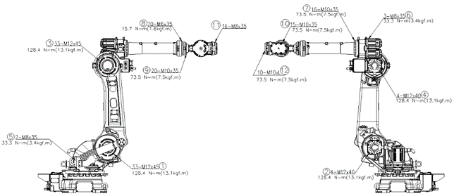

# 4.3. Inspection of Main External Bolts

<table>
<thead>
  <tr>
    <td>
    

      
    

    </td>
    <td colspan="4">The recommended bolt torques are shown in the figure below.

Must tighten the bolts with appropriate torques by using a torque wrench and then mark them with paint.
Please use 12.9T (strength grade) bolts.
</td>
  </tr>
</thead>
</table>  

Table 4-3 Main Bolts to be Inspected 

<table class="tg">
<thead>
  <tr>
    <th class="tg-1e26">No.</th>
    <th class="tg-1e26">Bolts to be Inspected</th>
    <th class="tg-1e26">No.</th>
    <th class="tg-1e26">Bolts to be Inspected</th>
  </tr>
</thead>
<tbody>
  <tr>
    <td class="tg-t1e1">1</td>
    <td class="tg-baqh">H axis reducer attachment bolt</td>
    <td class="tg-t1e1">7</td>
    <td class="tg-baqh">Arm pipe attachment bolt</td>
  </tr>
  <tr>
    <td class="tg-t1e1">2</td>
    <td class="tg-baqh">H axis attachment bolt</td>
    <td class="tg-t1e1">8</td>
    <td class="tg-baqh">R2 axis attachment bolt</td>
  </tr>
  <tr>
    <td class="tg-t1e1">3</td>
    <td class="tg-baqh">V axis attachment bolt</td>
    <td class="tg-t1e1">9</td>
    <td class="tg-baqh">Grip assembly attachment bolt</td>
  </tr>
  <tr>
    <td class="tg-t1e1">4</td>
    <td class="tg-baqh">V axis attachment bolt</td>
    <td class="tg-t1e1">10</td>
    <td class="tg-baqh">B axis attachment bolt</td>
  </tr>
  <tr>
    <td class="tg-t1e1">5</td>
    <td class="tg-baqh">Gas top plate attachment bolt</td>
    <td class="tg-t1e1">11</td>
    <td class="tg-baqh">R1 axis reducer attachment bolt</td>
  </tr>
  <tr>
    <td class="tg-t1e1">6</td>
    <td class="tg-baqh">Contraction motor attachment bolt</td>
    <td class="tg-t1e1">12</td>
    <td class="tg-baqh">End effector attachment bolt</td>
  </tr>
</tbody>
</table>

Figure 4.1 Main Bolts to be Inspected
