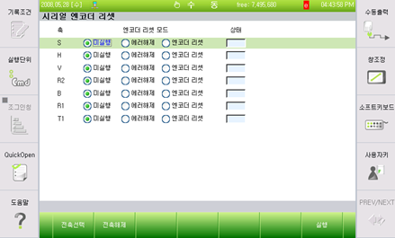

# 6.5.2. Resetting the Encoder

<ol style="list-style-type:decimal" start="1">
    <li>Turn off the motor.
</li> 
    <li>Bring up the serial encoder resetting window (『[F2]: System』 → 『5: Initialize』 → 『4: Reset the Serial Encoder』.)
  

 

</li> 
    <li>
    Move to the targeted axis by using the [↓],[↑], and [SHIFT]+[←][→] keys. After that press the [Execute] key.
</li> 
    <li>
After resetting the encoder, you must switch the controller power from the Off state to the On state.
</li>
</ol>
