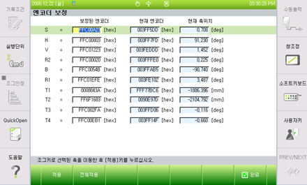

# 6.5.3. Calibrating and Selecting the Encoder

*	It is necessary to calibrate the encoder data at the reference position of each axis of the robot.
*	Calibrate the encoder by referring to the 『Calibrating the Encoder』 section in the Controller Operation Manual.

<b>[Screen for Encoder Calibration]</b>

Table 6-5 Data Range after Resetting

<table class="tg">
<thead>
  <tr>
    <th class="tg-jafi">Axis</th>
    <th class="tg-jafi">Data Range after Resetting</th>
    <th class="tg-jafi">Number of pulses per encoder revolution</th>
  </tr>
</thead>
<tbody>
  <tr>
    <td class="tg-wa1i">All axes</td>
    <td class="tg-nrix">0 ~ 8,191</td>
    <td class="tg-nrix">8,192</td>
  </tr>
</tbody>
</table>

<ol style="list-style-type:decimal" start="1">
    <li>
Select an axis and then move the axis to the reference position using the [Operate the Axis] key, then press the 『[F1]: Apply』 key.
    </li> 
    <li>
When you place every axis of the robot into the reference posture using the [Operate the Axis] key and press 『[F2]: Apply for All』 key, then the encoder offset calibration for all axes will be performed at once.
    </li> 
    <li>
To save the setting data, press 『[F7]: Complete』 key. If you press the [ESC] key, the changed data will not be saved.
</li>
</ol>

<table>
<thead>
  <tr>
    <td>
    

      
    

    </td>
    <td colspan="4"><b>Cautions</b> 
    When calibrating the encoder data after replacing the motor, you should put the Power Ready function into the 『ON』 state and then check whether the power is inputted to the motor.</td>
  </tr>
</thead>
</table>  

