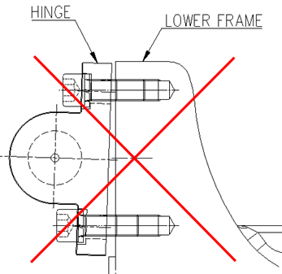

# 8.2.1. Separating the Gas Spring

When separating the gas spring, you must keep the H axis in the posture shown in the figure below. In this posture, the compression force of the gas spring will be minimized so that it can be separated from the robot. Therefore, even if the gas spring is separated from the manipulator, the compression force by the spring will be in balanced state, so the risk factors in the separation process will be minimized.

However, when required to separate the gas spring for disposing of it or repairing its internal parts, you should first remove the gas completely in accordance with the procedure for discharging gas from the gas spring.

Figure 8.1 Posture for Separating the Gas Spring

<table class="tg">
<thead>
  <tr>
    <th class="tg-baqh">S-Axis</th>
    <th class="tg-baqh">0</th>
  </tr>
</thead>
<tbody>
  <tr>
    <td class="tg-baqh">H- Axis</td>
    <td class="tg-baqh">90</td>
  </tr>
  <tr>
    <td class="tg-baqh">V- Axis</td>
    <td class="tg-baqh">0</td>
  </tr>
  <tr>
    <td class="tg-baqh">R2- Axis</td>
    <td class="tg-baqh">0</td>
  </tr>
  <tr>
    <td class="tg-baqh">B- Axis</td>
    <td class="tg-baqh">0</td>
  </tr>
  <tr>
    <td class="tg-baqh">R1- Axis</td>
    <td class="tg-baqh">0</td>
  </tr>
</tbody>
</table>

<blockquote>
<table border="0">
<thead>
  <tr>
    <td>
    

      
    

    </td>
    <td colspan="4">

*	When fastening or loosening the hinge bolts to separate or disassemble the gas spring, you need to rotate the upper and lower bolts alternately at less than 45 degrees as shown in the figure below to prevent the hinge from being excessively tilted. 
 Excessive tilting of the hinge will damage the bolt screw, and thus damaged bolt screw will damage even the tap of the lower frame, making it difficult to perform the disassembling and assembling works.

*	The shape of each part, such as the hinge, may change according to the design for mass production.

</td>
  </tr>
</thead>
</table>  
</blockquote>

[The amount of rotation of the bolt is 45 degrees or below: Approved]

[The amount of rotation of the bolt is 45 degrees or above: Not approved]
