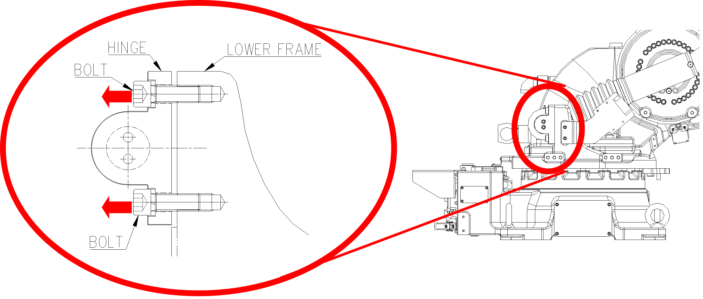

# 9.4.1. Separating the Gas Spring

You must keep the H axis at the posture as shown in [Figure 9.5] while separating the gas spring.

In this posture, the compression force of the gas spring will be minimized so that it can be separated from the robot.

Therefore, even if the gas spring is separated from the manipulator, the compression force by the spring will be in balanced state, so the risk factors in the separation process will be minimized.

However, when required to separate the gas spring for disposing of it or repairing its internal parts, or when impossible to put the H axis at 90° because the H axis does operate, you should remove the gas completely in accordance with the procedures of “9.3 Releasing the Gas of the Gas Spring.” 

<table class="tg">
<thead>
  <tr>
    <td class="tg-baqh">H- Axis</td>
    <td class="tg-baqh">90˚</td>
  </tr>
</thead>
</table>

Figure 9.5 Posture for Separating the Gas Spring

<blockquote>
<table border="0">
<thead>
  <tr>
    <td>
    

      
    

    </td>
    <td colspan="4">
    -	Postures in which the gas spring must not be separated : Angles of the H axis other than 90˚
    
In the posture of the H axis at angles other than 90˚, the compression force of the gas spring will be excessive, so when the bolt of the hinge is loosened, the screw thread will be damaged by the pressure of the gas spring and the bolt will be thrown out, causing accidents involving people and damage to the equipment.)  

</td>
  </tr>
</thead>
</table>  
</blockquote>
