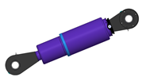
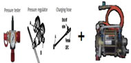
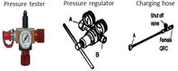
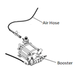

# 9.4.4. Parts for Gas Spring Pressure Measuring and Gas Charing

Table 9-3 Parts for Gas Spring Pressure Measuring and Gas Charing

<table class="tg">
<thead>
  <tr>
    <th class="tg-wa1i">Part name and specification</th>
    <th class="tg-wa1i">PLATE NO</th>
    <th class="tg-wa1i">Quantity per unit</th>
    <th class="tg-wa1i">Shape</th>
    <th class="tg-wa1i">Supplied by Classification</th>
  </tr>
</thead>
<tbody>
  <tr>
    <td class="tg-nrix">GAS SPRING & BS JOINT
& PLASTIC(1) & Nipple</td>
    <td class="tg-nrix">R3200-7230-002(1)</td>
    <td class="tg-nrix">1</td>
    <td class="tg-nrix" rowspan="4"></td>
    <td class="tg-nrix" rowspan="4">Hyundai Robotics(option)</td>
  </tr>
  <tr>
    <td class="tg-nrix">Bearing Collar</td>
    <td class="tg-nrix">R3200-7230-218</td>
    <td class="tg-nrix">2</td>
  </tr>
  <tr>
    <td class="tg-nrix">Spherical Bearing 22208</td>
    <td class="tg-nrix">R3200-7230-P02</td>
    <td class="tg-nrix">2</td>
  </tr>
  <tr>
    <td class="tg-nrix">Nilos Ring 22208JV</td>
    <td class="tg-nrix">R3200-7230-P03</td>
    <td class="tg-nrix">4</td>
  </tr>
  <tr>
    <td class="tg-nrix">PRESSURE TESTER-1
(for measuring the pressure)</td>
    <td class="tg-nrix">R3200-7230-R01</td>
    <td class="tg-nrix">1</td>
    <td class="tg-nrix"></td>
    <td class="tg-nrix">Hyundai Robotics(option)</td>
  </tr>
  <tr>
    <td class="tg-nrix">REPLENISHING ARMATURE KIT-1
+ GAS BOOSTER KIT-1

1. For charging the gas when the nitrogen gas bombe pressure is 150 bar or below
2. Item to be included when the customer orders

   : Specification for the connection part screw of the nitrogen gas bombe
</td>
    <td class="tg-nrix">R3200-7230-R05
+ R3200-7230-R03</td>
    <td class="tg-nrix">1</td>
    <td class="tg-nrix"></td>
    <td class="tg-nrix">Hyundai Robotics(option)</td>
  </tr>
  <tr>
    <td class="tg-nrix">REPLENISHING ARMATURE KIT-1

1. For charging the gas when the nitrogen gas bombe pressure exceeds 150 bar

2. Item to be included when the customer orders
: Specification for the connection part screw of the nitrogen gas bombe
</td>
    <td class="tg-nrix">R3200-7230-R05</td>
    <td class="tg-nrix">1</td>
    <td class="tg-nrix"></td>
    <td class="tg-nrix">Hyundai Robotics(option)</td>
  </tr>
  <tr>
    <td class="tg-nrix">GAS BOOSTER KIT-1

1. For increasing the pressure when the nitrogen gas bombe pressure is 150 bar or below

2. AIR INLET PLUG MALE : R1/4

3. Item to be included when the customer orders

   : Specification for the connection part screw of the nitrogen gas bombe
</td>
    <td class="tg-nrix">R3200-7230-R03</td>
    <td class="tg-nrix">1</td>
    <td class="tg-nrix"></td>
    <td class="tg-nrix">Hyundai Robotics(option)</td>
  </tr>
  <tr>
    <td class="tg-nrix">Air hose and quick coupling
(for supplying air)</td>
    <td class="tg-nrix">-</td>
    <td class="tg-nrix">1</td>
    <td class="tg-nrix"></td>
    <td class="tg-nrix">Customer</td>
  </tr>
</tbody>
</table>