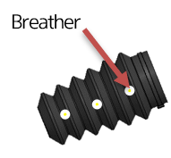
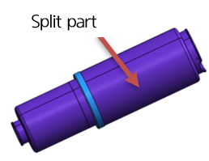
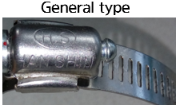

# 9.4.5. Gas Spring Protection Cover

<table class="tg">
<thead>
  <tr>
    <th class="tg-amwm">Classification</th>
    <th class="tg-amwm">BELLOWS</th>
    <th class="tg-amwm">Plastic Cover</th>
    <th class="tg-amwm">Remarks</th>
  </tr>
</thead>
<tbody>
  <tr>
    <td class="tg-amwm">Appearance</td>
    <td class="tg-baqh"></td>
    <td class="tg-baqh"></td>
    <td class="tg-baqh"></td>
  </tr>
  <tr>
    <td class="tg-amwm">Material</td>
    <td class="tg-baqh">RUBBER(all-in-one type)</td>
    <td class="tg-baqh">PLASTIC(split type)</td>
    <td class="tg-baqh"></td>
  </tr>
  <tr>
    <td class="tg-amwm">Required to disassemble the gas spring when replacing the protection cover</td>
    <td class="tg-baqh">O</td>
    <td class="tg-baqh">X</td>
    <td class="tg-baqh"></td>
  </tr>
  <tr>
    <td class="tg-amwm">Specification for the clamp</td>
    <td class="tg-baqh">○ Small size : Cable tie ○ Large size : 12W x Φ103 ○ Wrench torque :  - ○ Tightening torque :  - </td>
    <td class="tg-baqh">○ Small size : 12W x Φ54 ○ Large size : 12W x Φ103 ○ Wrench torque : 8mm ○ Tightening torque : 60kg/㎠</td>
    <td class="tg-baqh"></td>
  </tr>
  <tr>
    <td class="tg-amwm">Images of Clamps</td>
    <td class="tg-baqh"></td>
    <td class="tg-baqh"></td>
    <td class="tg-baqh"></td>
  </tr>
  <tr>
    <td class="tg-amwm">Time for replacement</td>
    <td class="tg-baqh">When tearing occurs</td>
    <td class="tg-baqh">When damage because of an external impact occurs.</td>
    <td class="tg-baqh"></td>
  </tr>
  <tr>
    <td class="tg-amwm">Precautions for assembling</td>
    <td class="tg-baqh">When assembling the replacement protection cover, you should make the breathing hole face the inside (robot side.) Perform assembling inwards (to the robot side)</td>
    <td class="tg-baqh">Assemble in a way that there is no gap in the split part.</td>
    <td class="tg-baqh"></td>
  </tr>
</tbody>
</table>